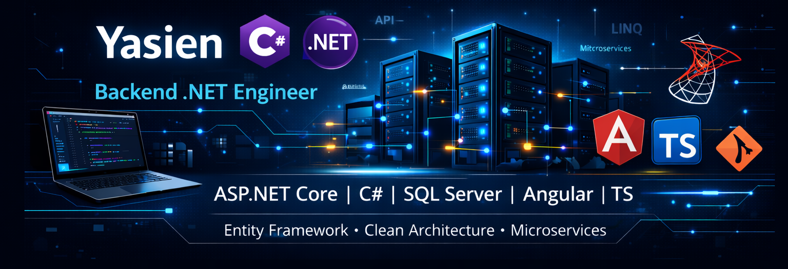

&nbsp;&nbsp;&nbsp;&nbsp;&nbsp;

# 👨‍💻 About Me

- 🧑‍💻 **Backend .NET Developer** | **Angular Frontend Developer**
- 🏢 **General Authority for Investment**
- 🌍 Based in **Egypt**
- 💡 Passionate about problem solving and backend systems
- 🌱 Always learning new technologies and improving my skills

---

# 💪 Skills

### Languages

---

### Frontend Frameworks

### Backend Frameworks

---

### Databases

---

### Tools & IDEs

---

# 📫 How to Reach Me

- [🔗 LinkedIn Profile](https://www.linkedin.com/in/yasien-ahmed-b8ab41325)
- [📧 Email](mailto:yasienahmed607@gmail.com)

---

# 🚀 Projects & Contributions

Explore my repositories to see my work and contributions in **.NET, Web Development, and Backend Systems**.

---

# 📊 GitHub Stats

  
  

---

## 👨‍💻 Author

### **Eng. Yasien Ahmed Elkelany**

💼 **Backend .NET Developer** | **Angular Frontend Developer**  
🏢 **General Authority for Investment**

[🔗 LinkedIn Profile](https://www.linkedin.com/in/yasien-ahmed-b8ab41325) | [📧 Email](mailto:yasienahmed607@gmail.com)

---

**Made with ❤️ by Eng. Yasien Ahmed Elkelany**

⭐ Star this repo if you find it helpful!

